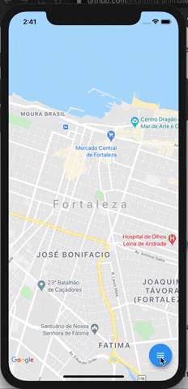

## Getting Started

This project is a starting point for a Dart
[package](https://flutter.io/developing-packages/),
a library module containing code that can be shared easily across
multiple Flutter or Dart projects.

For help getting started with Flutter, view our 
[online documentation](https://flutter.io/docs), which offers tutorials, 
samples, guidance on mobile development, and a full API reference.

##Screenshots



## Usage

To use this plugin:

In your flutter project add the dependency:

```yalm
dependencies:
    ...
    animated_float_action_button: ^1.0.0
```

## Example

```dart
//Import package
import 'package:animated_float_action_button/animated_floating_action_button.dart';
...
Widget add() {
    return FloatActionButtonText(
      onPressed: null,
      icon: Icons.add,
      text: "Add",
    );
  }

  Widget image() {
    return FloatActionButtonText(
      onPressed: null,
      icon: Icons.image,
      text: "Image",
    );
  }

  Widget inbox() {
    return FloatActionButtonText(
      onPressed: null,
      icon: Icons.inbox,
      text: "Inbox",
    );
  }
...
Scaffold(
    floatingActionButton: AnimatedFloatingActionButton(
        //Fab list
        fabButtons: <Widget>[
            add(), 
            image(),
            inbox(),
        ],
        colorStartAnimation: Colors.blue,
        colorEndAnimation: Colors.red,
        animatedIconData: AnimatedIcons.menu_close //To principal button
    ),
)
```
Complete [example here](https://github.com/macielcr7/animated_float_action_button/tree/master/example)